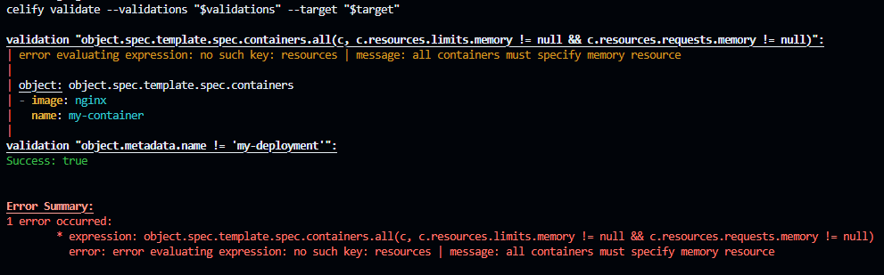

# celify
- [celify](#celify)
  - [Get started](#get-started)
    - [Install on Linux](#install-on-linux)
    - [Install on Windows](#install-on-windows)
    - [Example usage](#example-usage)
      - [Successfull validations](#successfull-validations)
      - [Failed validations](#failed-validations)
      - [Failed expression with multiple objects](#failed-expression-with-multiple-objects)

CLI to run CEL based validations agaisnt yaml or json.

The intention of this CLI is to provide a simple way to run validations against yaml or json files using [CEL](https://github.com/google/cel-go). Inspired by [k8s validating admission policy](https://kubernetes.io/docs/reference/access-authn-authz/validating-admission-policy/), the idea is to provide ease of integration with CI tools to validate not only Kubernetes manifests, but other yamls or jsons, e.g. Terraform plans, pipeline yamls and templates etc.

## Get started
### Install on Linux
```bash
# Downloads the CLI based on your OS/arch and puts it in /usr/local/bin
curl -fsSL https://raw.githubusercontent.com/rdalbuquerque/celify/master/scripts/install.sh | sh
```

### Install on Windows
```powershell
Invoke-RestMethod "https://raw.githubusercontent.com/rdalbuquerque/celify/master/scripts/install.ps1" | Invoke-Expression
```

### Example usage
#### Successfull validations

```bash
validations=$(cat <<EOF
validations:
- expression: "object.spec.template.spec.containers.all(c, c.resources.limits.memory != null && c.resources.requests.memory != null)"
  messageExpression: "'all containers must specify memory resource'"
- expression: "object.metadata.name != 'my-deployment'"
  messageExpression: "'expected deployment name to be different than my-deployment, got ' + object.metadata.name"
EOF
)
target=$(cat <<EOF
apiVersion: apps/v1
kind: Deployment
metadata:
  name: my-app
spec:
  template:
    spec:
      containers:
      - name: my-container
        image: nginx
        resources:
          limits:
            memory: 1Gi
          requests:
            memory: 1Gi
EOF
)
celify validate --validations "$validations" --target "$target"
```
Output:


#### Failed validations

In case of a failed validation, the output will show the message expression result and the evaluated object, if any.
```bash
# setting target to a deployment with no resource definition
target=$(cat <<EOF
apiVersion: apps/v1
kind: Deployment
metadata:
  name: my-app
spec:
  template:
    spec:
      containers:
      - name: my-container
        image: nginx
EOF
)

# running agaisnt the same validations
celify validate --validations "$validations" --target "$target"
```
Output:


#### Failed expression with multiple objects

In the case where multiple objects are being evaluated with `&&` or `||` operators, the output will show all evaluated objects.
```bash
# running a validation with multiple objects
target=$(cat <<EOF
apiVersion: apps/v1
kind: Deployment
metadata:
  name: my-app
  annotations:
    vcs: git
    env: dev
spec:
  template:
    spec:
      containers:
      - name: my-container
        image: team-a/nginx
EOF
)

celify validate --expression "object.spec.template.spec.containers.exists_one(c, c.image.startsWith('team-a')) && object.metadata.annotations.exists_one(a, a.team == 'team-a')" --target "$target"
```
Output:


OBS: In the case where a single expression is used instead of validations, there is no `messageExpression` available, so the error message will simply say `validation failed`.
